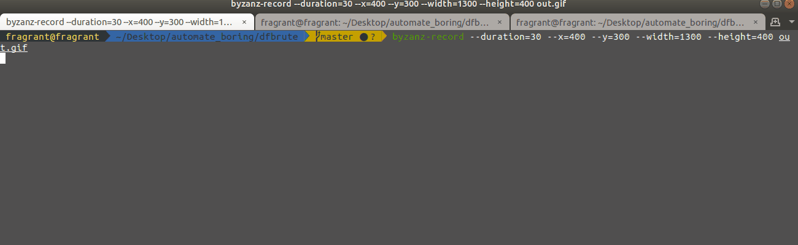

# dfbrute
Violent cracking for directories and files (目录和文件的暴力破解)


# screen




```
--------------------------
dfbrute v1.0
by fragrant
github https://github.com/fragrant10/dfbrute
--------------------------

Usage:
 python3 dfbrute01.py <url OR urls> worldList 2

EXAMPLES:
 python3 dfbrute01.py http://xxx.com/ worldList 2
 python3 dfbrute01.py https://xxx.com/ worldList 2
 python3 dfbrute01.py urlsFile worldList 2
```

# install


```
pip install -r requirements.txt
```


# [2019-07-12] 更新

增加自定义403排除功能
